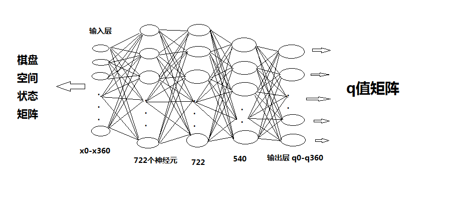
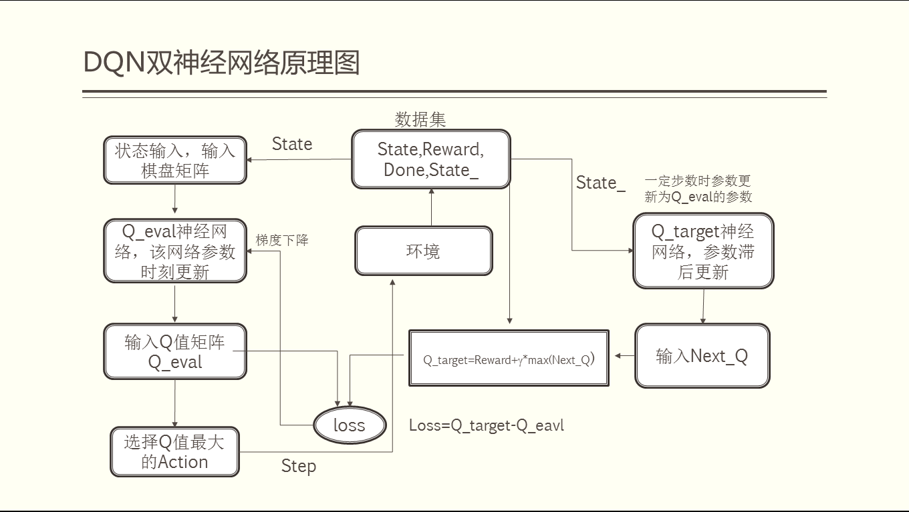
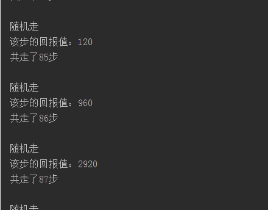
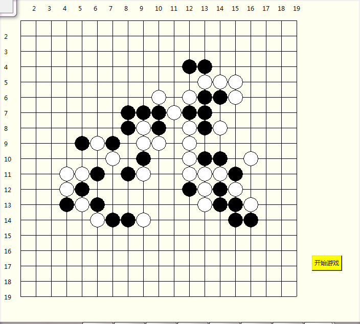
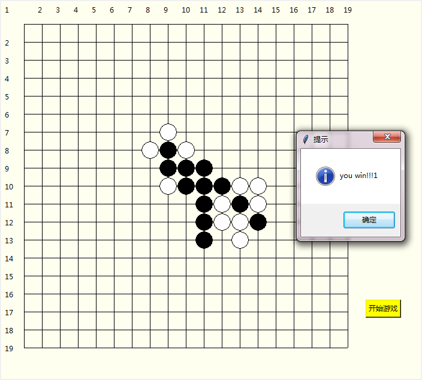

### 1.基于 tensorflow  的强化学习的五子棋人机对弈
深度强化学习，即 Deep Reinforcement Learning, 通过给每个 action 特定的 reward, 进行不断的尝试，使程序在某个状态 (state),的时候
可以朝着最大化的受益 (reward) action 变换 state, 基于强化学习的五子棋对弈人机对弈系统就基于这个原理出发。

### 2. Deep Reinforcement Learning 原理
[DQN 原理简述](./dqn原理.md)

### 2. 系统神经网络结构  

    

该神经网络的输入输出及相关状态：  

- 输入：19 * 19 的棋盘状态矩阵，其中 1-366 是代表计算机即是白子的棋盘状态，367-722 是非计算机方即是黑子的棋盘状态。
- 输出：一行 361 列的Q值矩阵，即是表示每个 action 所代表的q值(这里action用坐标表示)。五子棋神经网络用的双神经网络的方法，两个神神经网络的结构相同，分别是 Q-eval 和 Q_target.
- Q_eval：参数时刻更新，用于得到q表，从而选取动作。
- Q_target:参数滞后，主要用于保存以前的参数。

### 3.原理流程图  
  

### 4.激活函数
ReLu(Rectified Linear Units)激活函数。  

### 5.梯度下降
RMSProp方法。  

### 6. 更新过程
储存落子过程  memory

[s1,r1,a1,s_1]    
[s2,r2,a3,s_3]  
[sn,rn,an,s_n]  

即是    
[state, reward, action, state_next]  

表示当执行某个 action，使的 state 变为 state_next 获得的收益为 reward。 

存储了一定的数据量的时候随机从 memory 中选取 m 项数据，将[s1,s2,s3…..,sm]输入 Q_eavl(具有最新参数的神经网络)，得到 Q_eval = [q1:q2:q3,,,,:qm]，同理 [s_1,s_2,s_3…..,s_m] 输入 _target(滞后参数神经网络)，得到 Q_next = [q_1;q_2;q_3;,,,;q_m]。让后对相应 action 位置的 q 值进行更新，计算 target[0,ation] = R + gama * max(q_next), 其中gama为延迟回报率。计算误差：loss = target[0,ation]- Q_eval[0,ation]，将误差反向传播，修改神经网络结构参数。从而使落子的决策可以得到更多的回报值。

### 7. 计算机的自我对弈
这里将期盼的状态 (state), 用一个一维数组表示，其中 1 代表该位置为我方落子，2 代表对方落子，这样棋盘的每个状态都可以用一个一位数组表示。该棋盘初始状态如下：  

[  
  0, 0, 0, 0,....0,  
  0, 0, 0, 0,....0,  
  ., ., ., .,.....,  
  ., ., ., .,.....,  
  ., ., ., .,.....,  
  0, 0, 0, 0,....0,  
]
执行，先手(假设程序1)随机下，得到一个 state_0
[  
  0, 0, 0, 0,  
  0, 0, 1, 0,  
  0, 0, 0, 0,  
]  

此时程序2，看到的状态应该是(2 代表对方落子)，即是需要装换棋盘    
[  
  0, 0, 0, 0,  
  0, 0, 2, 0,  
  0, 0, 0, 0,  
]  

程序 2 将该 state 输入神经网络得到一个 action，并执行，假设如下

[  
  0, 0, 0, 0,  
  0, 0, 2, 0,  
  0, 1, 0, 0,  
]  

程序 1 侧目前所见目前棋盘状态 state_1

[  
  0, 0, 0, 0,  
  0, 0, 1, 0,  
  0, 2, 0, 0,  
]  

程序 1  将该 state 输入神经网络得到一个 action_1，并执行，假设如下,得到 state_2

[  
  0, 0, 0, 0,  
  0, 1, 1, 0,  
  0, 2, 0, 0,  
]    

然后根据 state_2, 根据棋盘的连子情况(自定得分规则), 得到该 action_1 动作的得分，即得到一条数据  

[state_1, reward_1, action_1, state_2], 当执行到一定步数的时候，利用这些数据来反向修改神经网络的参数，
使其能够沿着能够生成最大 reward 的 action 趋近。

### 8. 运行截图
1. 程序日志

  

2. 计算机自我对弈训练落子分布  

  

3. 人机对弈落子分布  

   

### 9.运行环境
- python 3.5
- tensorflow
- tkinter
- numpy

#### 10.运行方式 
运行trun_this.py进行计算机自我对弈训练
运行run 经行人机对弈

### 11.总结

#### 1. 结果
 经过计算机不断地自我对弈，在计算机的人机对弈的测试中，计算机会根据最大的 q 值下，也都会收到一些回报值，也就是说，在对弈的过程中，计算机五子棋程序已具备一些智能。

#### 2. 不足之处
落子不够智能
可能原因： 
 1. 训练数据不够准确。
 2. 训练数据量太少
 3. 神经网络结构问题

