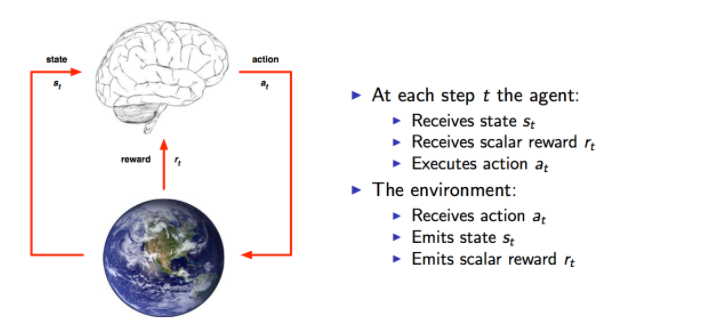

  
  ### DQN 原理
  深度增强学习 Deep Reinforcement Learning 是将深度学习与增强学习结合起来从而实现从 Perception 感知到 Action 动作的端对端学习的一种全新的算法。简单的说，就是和人类一样，输入感知信息比如视觉，然后通过深度神经网络，直接输出动作，中间没有 hand-crafted 工作。深度增强学习具备使机器人实现完全自主的学习一种甚至多种技能的潜力。在人工智能领域，一般用 Agent 来表示一个具备行为能力的物体，比如机器人，无人车，人等等。那么增强学习考虑的问题就是 Agent 和环境，  environment 之间交互的任务。比如一个机械臂要拿起一个手机，那么机械臂周围的物体包括手机就是环境，机械臂通过外部的比如摄像头来感知环境，然后机械臂需要输出动作来实现拿起手机这个任务。再举玩游戏的例子，比如我们玩极品飞车游戏，我们只看到屏幕，这就是环境，然后我们输出动作（键盘操作）来控制车的运动。那么，不管是什么样的任务，都包含了一系列的动作 action,观察 Observation 还有反馈值 Reward。所谓的 Reward 就是 Agent 执行了动作与环境进行交互后，环境会发生变化，变化的好与坏就用 reward 来表示。如上面的例子。如果机械臂离手机变近了，那么 reward 就应该是正的，如果玩赛车游戏赛车越来越偏离跑道，那么reward就是负的。接下来这里用了Observation 观察一词而不是环境那是因为 Agent 不一定能得到环境的所有信息，比如机械臂上的摄像头就只能得到某个特定角度的画面。因此，只能用Observation 来表示 Agent 获取的感知信息。  

上面这张图（来自David Silver）可以很清楚的看到整个交互过程。事实上，这就是人与环境交互的一种模型化表示。在每个时间点 time-step Agent 都会从可以选择的动作集合 A 中选择一个 a_t 执行.这个动作集合可以是连续的比如机器人的控制也可以是离散的比如游戏中的几个按键。动作集合的数量将直接影响整个任务的求解难度，因此 DeepMind 才从玩最简单的游戏做起。那么知道了整个过程，任务的目标就出来了，那就是要能获取尽可能多的reward。没有目标，控制也就无从谈起，因此，获取 reward 就是一个量化的标准，reward越多，就表示执行得越好。每个时间片，Agent都是根据当前的观察来确定下一步的动作。每次的观察就作为 Agent 的所处的状态 state，因此，状态 State 和动作 Action 存在映射关系，也就是一个 state 可以对应一个 action，或者对应不同动作的概率（常常用概率来表示，概率最高的就是最值得执行的动作）。那么 state 到 action 的过程就称之为一个策略Policy。增强学习的任务就是找到一个最优的策略 policy 从而使 reward 最多。我们一开始并不知道最优的策略是什么，因此往往从随机的策略开始，使用随机的策略进行试验，就可以得到一系列的状态,动作和反馈：  

{s1,a1,r1,s2,a2,r2,...,at−1,st}  

这就是一系列的样本Sample。增强学习的算法就是需要根据这些样本来改进policy，从而使得得到的样本中的reward更好。由于这种让reward越来越好的特性，所以这种算法就叫做增强学习Reinforcement Learning。
